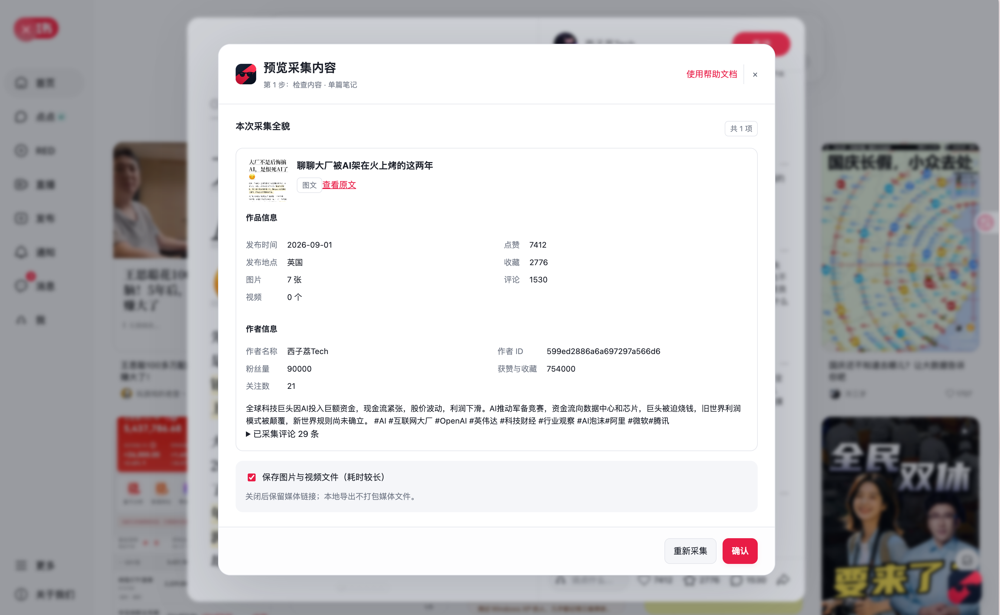
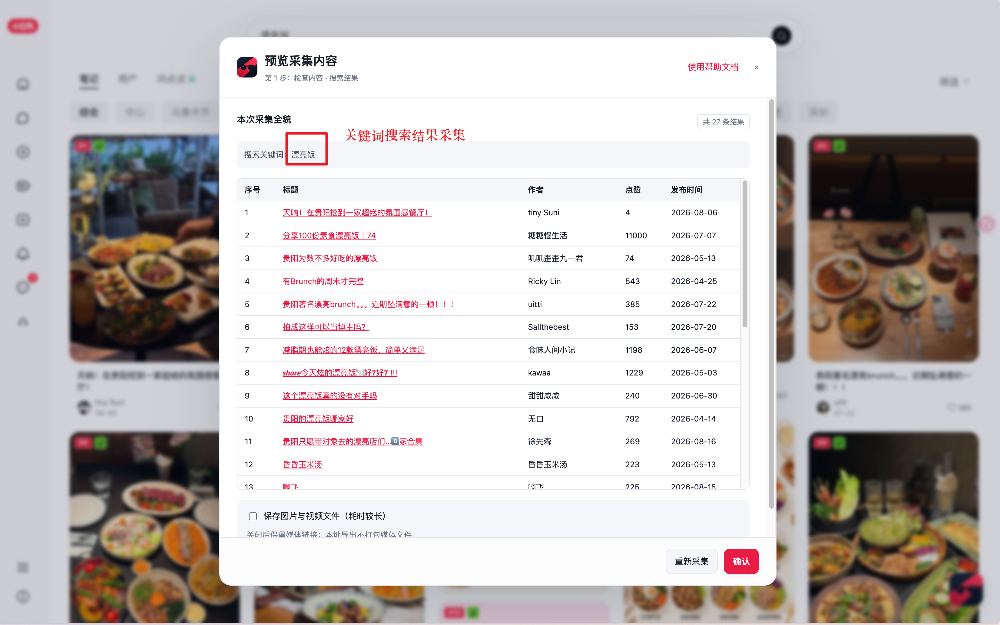
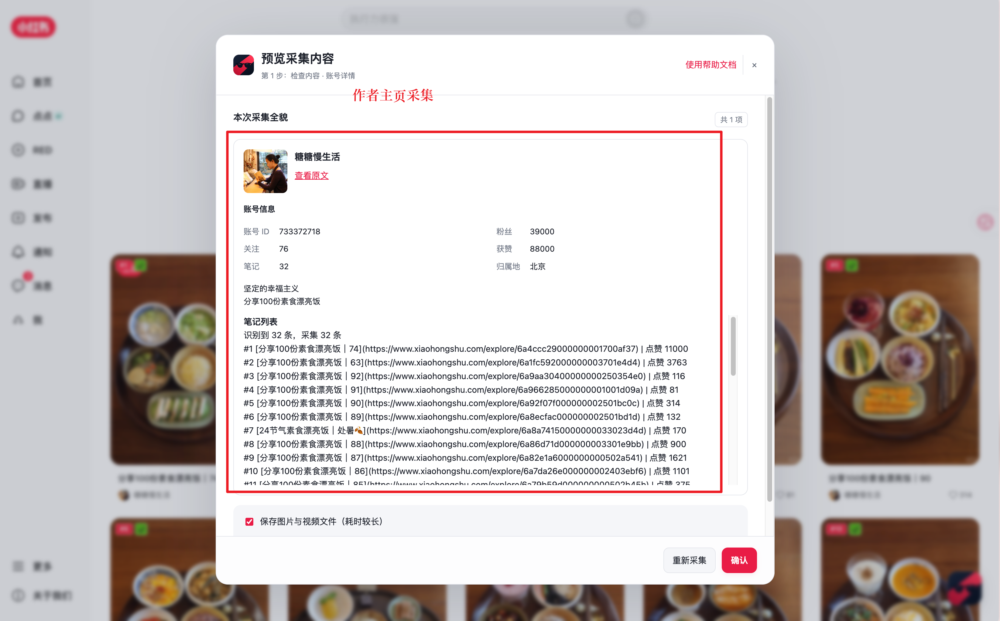
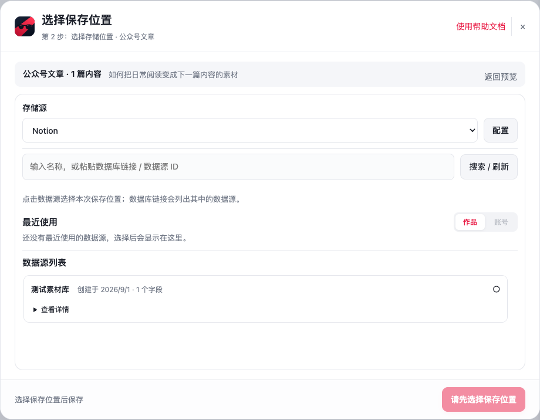

<div align="center">


# 抄级对标｜小红书、抖音浏览器采集插件

**一款浏览器采集插件，支持采集搜索结果、作品详情、作品评论和作者详情。**

采集正文、图片、视频与互动数据，用于个人研究学习和后续 AI 分析。

**支持存储到 Notion 数据库、本地（CSV / Markdown）、飞书多维表格。**

**非自动化采集**

[**下载插件**](https://github.com/ChaoJiDuiBiao/cjdb-web-crawler/releases) · [**使用说明**](#使用说明) · [**问题反馈**](https://github.com/ChaoJiDuiBiao/cjdb-web-crawler/issues)

<sub>v2.0.2</sub>

</div>

## 演示视频

https://github.com/user-attachments/assets/ed365ea3-4af0-438e-8c6c-6d9b0549e834

[查看高清视频](docs/showcase/videos/demo.mp4)

## 功能

| 采集范围 | 内容 |
| --- | --- |
| **搜索结果** | 作品列表、标题、作者、互动数据与链接 |
| **作品详情** | 正文、图片、视频、发布时间与互动数据 |
| **作品评论** | 已加载的评论内容 |
| **作者详情** | 作者资料、粉丝量、获赞等数据 |

同时支持公众号文章、飞书文档采集。

## 存储

| 存储方式 | 支持形式 |
| --- | --- |
| **Notion 数据库** | 搜索数据源、最近使用快捷选择 |
| **本地** | CSV、Markdown、媒体文件 |
| **飞书多维表格** | 保存到指定表格 |

## 界面截图

**作品详情预览**



**搜索结果采集**



**作者详情采集**



**选择保存位置**



<sub>作品详情预览与保存位置截图使用演示数据。</sub>

## 使用说明

### 方式一：本地构建

先安装 Node.js 和 Git，然后执行：

```bash
git clone https://github.com/ChaoJiDuiBiao/cjdb-web-crawler.git
cd cjdb-web-crawler
npm ci
npm run build
```

打开 Chrome 的 `chrome://extensions`，开启“开发者模式”，点击“加载已解压的扩展程序”，选择 `output/抄级对标数据采集器-v2.0.2` 文件夹。刷新目标网页即可使用。

### 方式二：下载安装包

1. 前往 [Release 下载页面](https://github.com/ChaoJiDuiBiao/cjdb-web-crawler/releases/latest)，下载 `cjdbcrawler-版本号-chrome.zip` 安装包。
2. 解压 ZIP 文件。
3. 打开 Chrome 的 `chrome://extensions`，开启“开发者模式”。
4. 点击“加载已解压的扩展程序”，选择解压后包含 `manifest.json` 的文件夹。
5. 刷新目标网页即可使用。

## 交流与反馈

[提交问题或功能建议](https://github.com/ChaoJiDuiBiao/cjdb-web-crawler/issues)

<p align="center">
  
  <br>交流学习欢迎扫码添加微信
</p>

## 使用声明

**仅供个人研究学习，严禁用于商业及其他违法用途。**
